This is the final project of EE 660, USC.

### Abstract

In this problem, I will use 20 news text data set with supervise learning and transfer learning. I will first use word embedding method to preprocess the data. In supervise learning part, I will try different classification model to classify the data and make comparison. Pick up the best model and test it on the test set. In transfer learning part, I will separate the data again to fit for the transfer learning problem. Then try Subspace Alignment, Tr Ada Boost, and Importance Weighting combine with the supervise learning model. Finally, I will analyze the result and make conclusions.  

This is a classification problem. The dataset combined with 20 classes of news, which include computer topic, recreation topic, science topic and so forth. And my goal is to classify 20 news datasets. My work includes 2 parts, machine learning part and transfer learning part.  

This is a classification problem. The dataset combined with 20 classes of news, which include computer topic, recreation topic, science topic and so forth. And my goal is to classify 20 news datasets. My work includes 2 parts, machine learning part and transfer learning part.  

Then in part 2, I will try different transfer learning methods combine with the stage 1 models. Not all the methods are fitful for this problem, thus I will compare the results and pick the most fitful one. This transfer learning part is also useful in some cases. For example, we have lots of machine learning news with a few of deep neuron network news since it is a new topic these years. The information gained from machine learning news can help us build a better model for the deep neuron network news by transfer learning strategy.  

click [here](https://github.com/Jingxiang-Zhang/20NewsTextClassification/blob/main/Project_Report.pdf) to view the report.

### Introduction of this folder

In this README.md file, I will explain each part of my code. Please read all the README.md file before move on. I will use the following additional library to implement my project:

- numpy: matrix operation
- sklearn: machine learning model
- scipy: use the sparse matrix module
- adapt: transfer learning model

##### 1. 20news/matlab/

This is the dataset of 20 news, you can use this dataset directly, or click [here](http://qwone.com/~jason/20Newsgroups/) to read more about this dataset. To download the processed (word embedding) dataset, you can use this link: [20news-bydate-matlab.tgz](http://qwone.com/~jason/20Newsgroups/20news-bydate-matlab.tgz). Or, you may also download the original text data in the website.

This folder have 7 files, which are listed as following:

- vocabulary.txt: the dictionary of all the data. For example, "archive" is the first word with code 1, and "name" is the second word with code 2. There are 61188 words in this dictionary, which means the word is encoded from 1 to 61188.
- train.map: map from class name to number. Each line is a item in the map. For example, line 1 is alt.atheism and 1, which means if one news labeled with 1, then this news belong to alt.atheism class.

- train.data: the preprocessed data. Each line has 3 numbers. First number is the news id (each news has a unique id), second number is the word code, third number is the times the news use this word.
- train.label: a binary type of file, hold the label of each news.

- test.map, test.data, test.label: the same as the train.

##### 2. load_datapy

Function use to load the data. All the function name is self interpretable. I will explain some functions that may confuse you.

- to_sparse_matrix: as you can see, the data load from train.data and test.data is a sparse matrix format,
  - first number is the news id (each news has a unique id), stand for the row number of the input data matrix (the id of data point)
  - second number is the word code, stand for the column number of the input data matrix
  - third number is the times the news use this word, stand for the value of this selected item in the matrix.

  This function transform this sparse matrix to `numpy` data matrix. (actually this function should called to_dense_matrix). Because all the machine learning (such as `sklearn`) need a matrix as input.

- to_scipy_sparse_matrix: given the original data input, this function will transform it to `scipy` sparse matrix format. Mind that `sklearn` can take this sparse matrix format as data input, and this is way faster  than dense matrix given text dataset. But some library (like `adapt` library in transfer learning) only take dense matrix as input.
- spearate: separate the training set into training set and validation set.

##### statistic.py

compare the classification result and save the file into Excel form.

- compare_prediction: traditionally, if you use `np.sum(prediction==label)`, you will get a overall accuracy. This function aim to calculate the accuracy of each class.

- save_to_file: save the result to Excel. Make it easy to compare between different models.

##### SL.ipynb

This file has all the supervise learning process. Please use `jupyter notebook`  to open this file. All the modules, all the functions in this file have sufficient comment.

##### TL.ipynb

This file has all the transfer learning process. Please use `jupyter notebook`  to open this file. All the modules, all the functions in this file have sufficient comment.

##### Statistic File

All the .xlsx file listed below is generated by the code, use to save the result

- Supervise Learning part:
  - train.xlsx: the training result for supervise learning
  - validation.xlsx: the validation result for supervise learning
  - train_final.xlsx: final training result for supervise learning, training on the whole training set and validation set
  - test_final.xlsx: final test result for supervise learning
- Transfer Learning part:
  - TL_none.xlsx: transfer learning part with no method
  - TL_sa.xlsx: transfer learning part with subspace alignment
  - There is also a transfer learning part with Tr Ada Boost, you can run the code to get the result

##### model

This file save all the final test model. In supervise learning part ,the final test use MLP (multiple layer perceptron) with hidden node = 256. However, the model is larger than 100MB, which exceed the maximum upload size. Hence, I simplify the model with no hidden layer. Mind that the result maybe slightly worse than my report. You can try to set `hidden_layer_sizes=(256,)` to get my result. But it may need to take a relative long time to retrain the model.

### 1. classification

##### 1.1 Data Set

The dataset I use is 20news dataset, which has several top-level categories, and for each top-level category it has many second-level categories, and even third-level categories. 

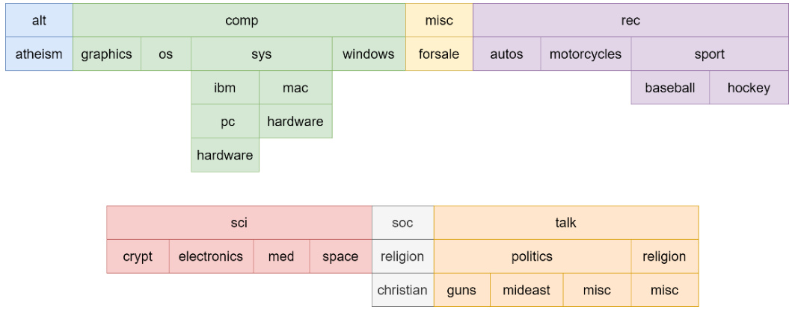

From the plot above, there are 7 top-level categories, and 20 sub-level categories. For each category, it has the numbers of data as the following table show.  

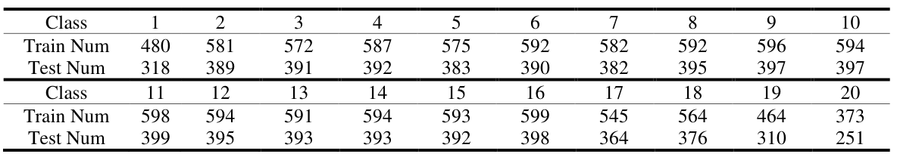

There are totally 11269 train data points, and 7505 test data points. The maximum variation of the dataset is 1.61. So, the dataset is balanced when only considering the sub level category. 

##### 1.2 Technical roadmap

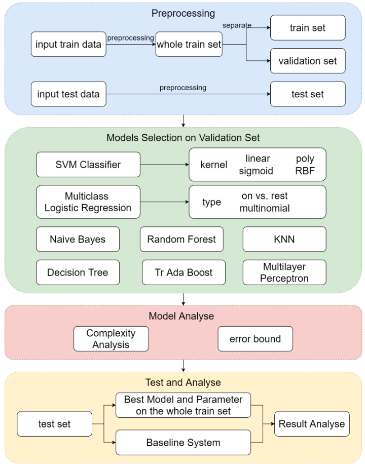

#####  1.3 Model Selection and Comparison of Results 

 Result for train set (not the whole train set). All the model that accuracy higher than 0.99 is bold. 

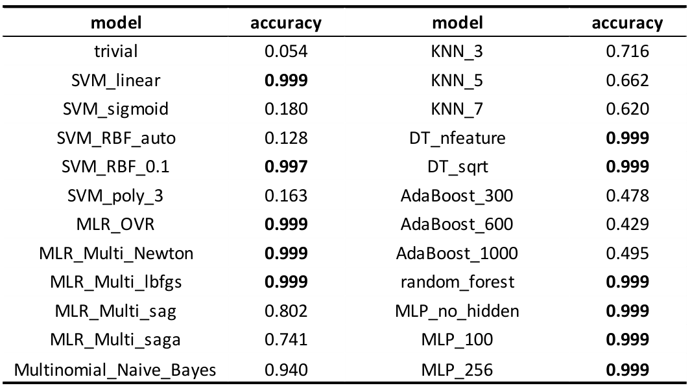

 Result for validation set. All the model that accuracy higher than 0.8 is bold.  

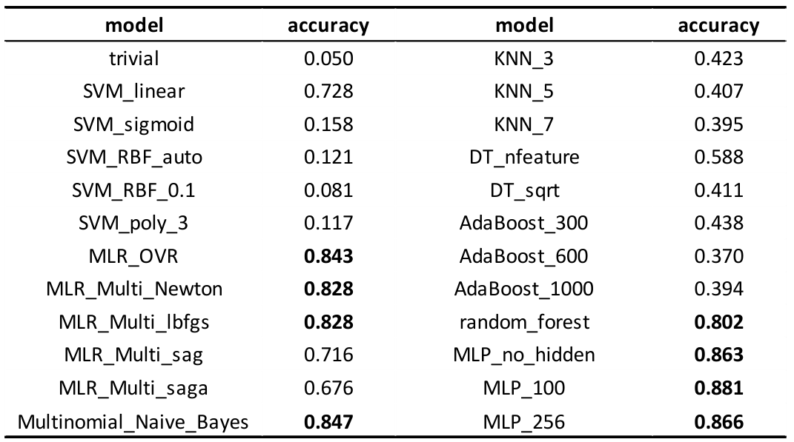

I pick up all the models that accuracy greater than 0.8 on the validation set, and calculate the accuracy on each class, and here is what I got. From the figure below, we can find that all of the model are not good at classify comp.os.ms-windows.misc, comp.sys.ibm.pc.hardware, comp.windows.x, and sci.electronics. 

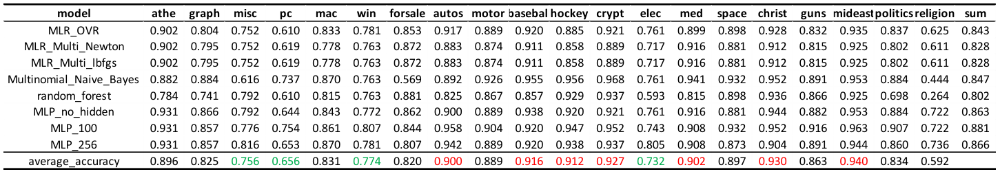

**Final Results and Interpretation:**

I will only use two baseline models (trivial one and SVM with linear kernel) to make the comparison with the best model, which is Multilayer Perceptron with 100 nodes in the hidden layers. Use adam for gradient descent strategy, learning rate = 0.0001, batch size = 200, epoch = 100, use ReLU as activation function. This time, I train these 3 models on the whole training set, and test it on the test set. 

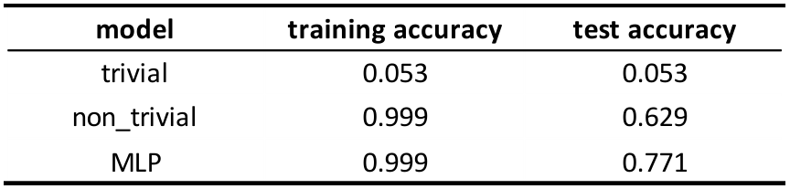

From the result, we can find that the accuracy of both the MLP and not trivial models decrease from the validation set, I guess maybe the training set is slightly different from the test set. The out-sample error bound is: 

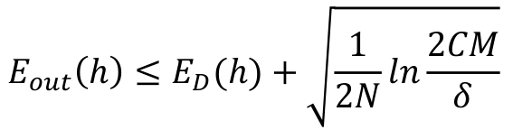

In this case, C = 20, let’s suppose δ = 0.1. 

In the validation step, N = 9016, M = 24. So, the bound is 0.023 

In the test step, N = 11269, M = 1. So, the bound is 0.016 

###  2. Transfer Learning 

##### 2.1 Data Set 

I will use "comp", "rec", "sci", "talk" as 4 top layer label, and label the corresponding data points as 0, 1, 2, and 3. For each top layer group, I will select the first two subgroup as source domain data, and the remaining as the target domain data. 

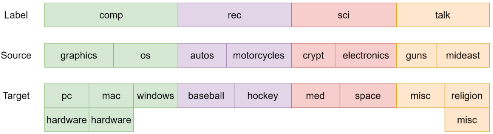

##### 2.2 Technical roadmap

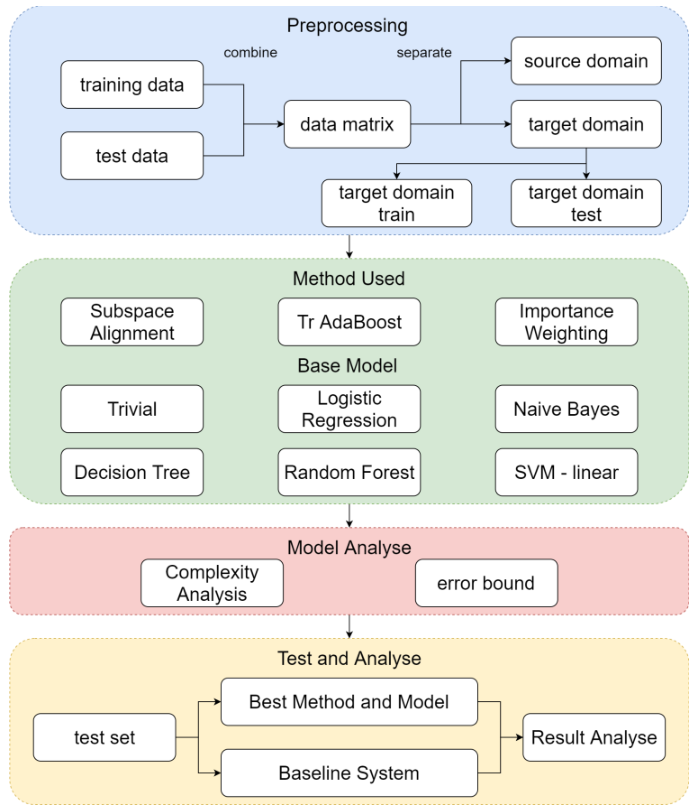

#####  2.3 Model Selection and Comparison of Results 

SA method cannot use Naïve Bayes, because Naïve Bayes request all the input data should be positive, however, when doing the transformation, some of the data will become negative. Therefore, there are no Naïve Bayes result in SA 

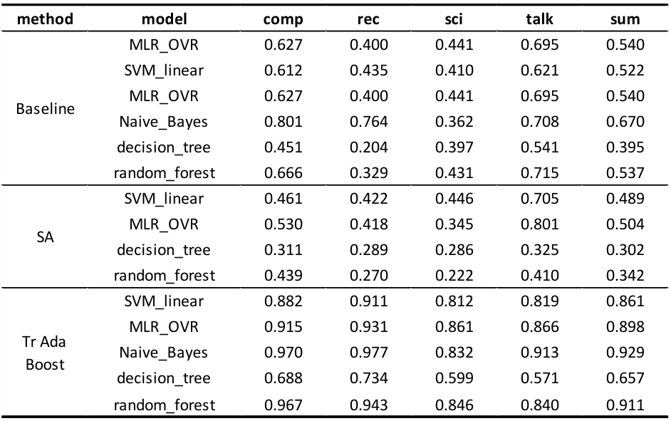

From the result, I conclude that:  

1. The classification accuracy for different group is vary model by model. When use baseline transfer learning (without using transfer learning) with SVM linear kernel, the highest accuracy is "talk" group. However, in Naïve Bayes, the highest accuracy group is "computer". Therefore, we can’t say which group’s source domain and target domain is closer to each other.  

2. SA method is always worse than baseline. Because SA is good at handling low dimension data, and it need some labeled target domain data to help it "flip" the prediction. In this problem, the data is high dimensional, it is not suitable for this method. Adjust the data distribution in the source domain will make the model predict the wrong result. 

3. From the table above, Tr Ada Boost is always better than baseline. Because Tr Ada Boost is the only model here using target domain data and label to help it adjust the weight value. It is target oriented, always use target data and label to make the model perform better on the target domain.  

Only consider the error bound on the best performance model, which is using Tr Ada Boost and Naïve Bayes.  

The out-sample error bound is:  

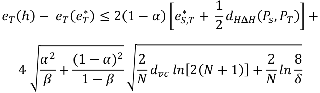

Where α: importance of error in target domain, suppose it is 0.5 

β: fraction of labeled data points drawn from target domain, in this case is 7735/ (7735+4140) = 0.651 

eS,T* : is the combined error = minh∈H {eS(h) + eT(h)}. I retrain and make prediction on the source and target domain again, and get 0.255.  

dHΔH(PS, PT): Symmetric difference hypothesis divergence = 2 suphh’∈H{|PS[h≠h’]- PT[h≠h’]|}, suppose it is 0.1 in this case. 

In this case, N = 16015, dvc = 2 (total 4 classes), let’s suppose δ = 0.1.  

The final error bound is: 0.54.  

### 3. Summary and conclusions 

Text data is completely different with all other data I have handled before. It is sparse and high dimensional, which require some new strategy to deal with. Over all the models I use, whatever in the supervise learning part or the transfer learning part, SVM with linear kernel, Naïve Bayes, Random Forest, and Logistic Regression is always good choices for handling text data.  

In this project, I only use one-hot encoding method to preprocess the text data, in the future, I may try other word embedding method in NLP and see whether it perform better or not.  

